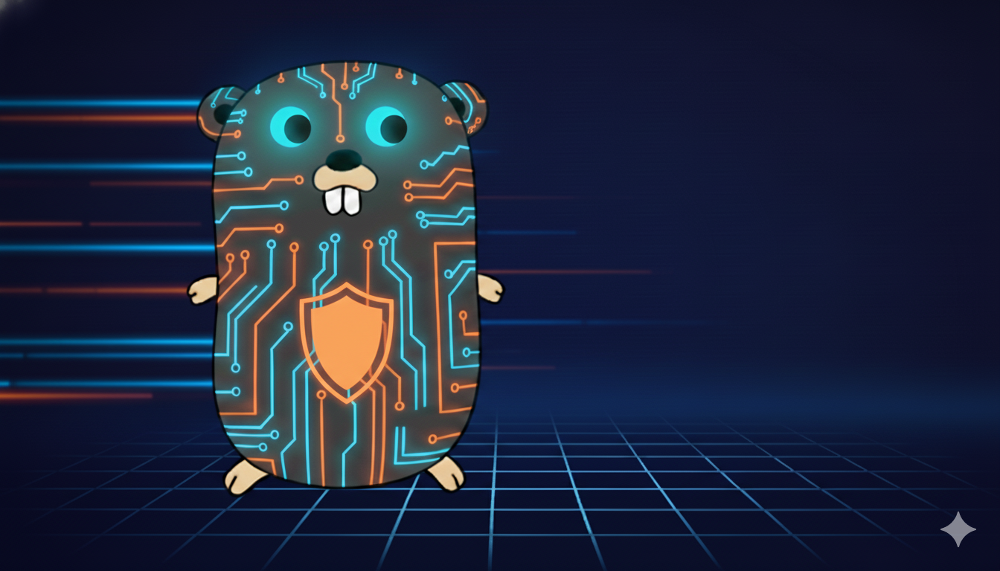

# Go Runtime Observer

Log what your Go code actually does at runtime - including calls to `reflect`, `unsafe`, and other standard library operations.

<p align="center">
  
</p>

<p align="center">
  <small><i>Disclaimer: I'm a developer, not a graphic designer. This gopher was created in collaboration with <a href="https://gemini.google.com/">Google's Gemini</a>. Contributions from actual artists are cheerfully welcome!</i></small>
</p>

## What It Does

Instruments a Go toolchain to capture runtime behavior. When you build with an instrumented Go, it logs operations like:

- **Reflection operations**: `reflect.ValueOf`, `reflect.TypeOf`, `reflect.Value.Call`, `reflect.Value.Set`, `reflect.Value.Method`, `reflect.MakeMap`, `reflect.New`
- **Unsafe operations**: `unsafe.Add`, `unsafe.Slice`, `unsafe.String` (memory manipulation)
- Any standard library function you configure

Your code stays completely untouched. The instrumentation happens during compilation in temporary directories.

**Call Graph Reconstruction**: Correlation tracking bridges gaps between dynamic operations (e.g., `MethodByName` → `Call`), enabling complete call graph analysis. See `docs/correlation-algorithm.md` for details.

## Why Use This

**Security Analysis**: See if your dependencies use reflection or unsafe operations you didn't know about.

**CVE Triage**: Quickly determine if vulnerable code paths are actually executed in your application.

**Dependency Auditing**: Understand what third-party packages really do at runtime, not just what they import.

## Comparison with Other Tools

| Approach                                      | Compile-time | Runtime | Reflection-aware | Correlates `MethodByName` → `Call` |
| --------------------------------------------- | ------------ | ------- | ---------------- | ---------------------------------- |
| **Static analysis** (`go vet`, `staticcheck`) | ✅           | ❌      | ❌               | ❌                                 |
| **CPU Profiler** (`pprof`)                    | ❌           | ✅      | ❌               | ❌                                 |
| **Execution Tracer** (`go tool trace`)        | ❌           | ✅      | ❌               | ❌                                 |
| **Debugger** (`delve`)                        | ❌           | ✅      | ⚠️               | ❌                                 |
| **eBPF/uprobes**                              | ❌           | ✅      | ❌               | ❌                                 |
| **Go Runtime Observer**                       | ✅           | ✅      | ✅               | ✅                                 |

## Quick Start

```bash
# Build and run the example
make dev-docker-run
```

Output shows calls from your code, dependencies, and the standard library. Each log entry is a JSON object with `operation`, argument fields (flattened), `caller`, `file`, and `line`:

```json
{"operation":"reflect.ValueOf","i":"1374390599712","caller":"main.main","file":"/work/main.go","line":32}
{"operation":"reflect.Value.MethodByName","v":"1374390599712","name":"Add","caller":"main.main","file":"/work/main.go","line":34}
{"operation":"reflect.Value.Call","v":"1374390599712","in":"1","method_name":"Add","correlation_seq":"1","caller":"main.main","file":"/work/main.go","line":35}
{"operation":"reflect.ValueOf","i":"549755813888","caller":"gopkg.in/yaml.v3.unmarshal","file":"/tmp/go-runtime-observer-abc123/dependency/gopkg.in/yaml.v3/yaml.go","line":163}
{"operation":"reflect.MakeMap","typ":"map[string]interface {}","caller":"gopkg.in/yaml.v3.(*decoder).mapping","file":"/tmp/go-runtime-observer-abc123/dependency/gopkg.in/yaml.v3/decode.go","line":823}
{"operation":"unsafe.Add","ptr":"0x140001e4448","len":"-48","caller":"main.main","file":"/tmp/go-runtime-observer-abc123/user/app/main.go","line":88}
```

## How It Works

1. Install instrumentation into a Go toolchain (local or Docker container)
2. Build your application with the instrumented Go
3. Run your application normally
4. Check the log file for captured operations

No changes to your code or build process required.

The instrumentation uses correlation tracking to connect dynamic operations (e.g., `MethodByName("Encrypt")` → `Call()`) for complete call graph reconstruction.

## Usage

### Pre-built Docker Images

Pre-built images are available on GitHub Container Registry:

```bash
# Pull specific framework version with Go 1.24.x
docker pull ghcr.io/smith-xyz/go-runtime-observer:go1.24-v1.0.0

# Pull latest framework for Go 1.24.x
docker pull ghcr.io/smith-xyz/go-runtime-observer:go1.24

# Pull latest development build
docker pull ghcr.io/smith-xyz/go-runtime-observer:edge

# Pull specific release (recommended)
docker pull ghcr.io/smith-xyz/go-runtime-observer:go1.24.9-v1.0.0
```

**Available tags:**

**Development builds (main branch):**

- `go1.24.9-edge` - Specific Go with latest development code
- `edge` - Latest Go with latest development code

**Release builds (tagged versions):**

- `go1.24.9-v1.0.0` - Specific Go + framework version (recommended for production)
- `v1.0.0` - Latest Go with specific framework version

**Version Strategy**: Images use tested, specific Go patch versions (not `latest` or minor versions). The framework has built-in version fallback, so any patch within a minor family (1.24.x) uses the same base config with optional patch-specific overrides.

Browse all available versions: https://github.com/smith-xyz/go-runtime-observer/pkgs/container/go-runtime-observer

**Using pre-built images:**

```bash
# Use specific release to build your app (recommended)
docker run --rm -v $(pwd):/work ghcr.io/smith-xyz/go-runtime-observer:go1.24.9-v1.0.0 build -o myapp .

# Or use edge for testing latest features
docker run --rm -v $(pwd):/work ghcr.io/smith-xyz/go-runtime-observer:edge build -o myapp .

# Run with logging enabled
INSTRUMENTATION_LOG_PATH=./runtime.log ./myapp

# View what happened
cat runtime.log
```

**Upgrade paths:**

```dockerfile
# Upgrade Go, keep framework stable
FROM ghcr.io/smith-xyz/go-runtime-observer:go1.23.12-v1.0.0
# Upgrade to:
FROM ghcr.io/smith-xyz/go-runtime-observer:go1.24.9-v1.0.0

# Upgrade framework, keep Go stable
FROM ghcr.io/smith-xyz/go-runtime-observer:go1.24.9-v1.0.0
# Upgrade to:
FROM ghcr.io/smith-xyz/go-runtime-observer:go1.24.9-v1.1.0

# Rollback framework
FROM ghcr.io/smith-xyz/go-runtime-observer:go1.24.9-v1.2.0  # Has issues
# Rollback to:
FROM ghcr.io/smith-xyz/go-runtime-observer:go1.24.9-v1.1.0  # Stable
```

**Need a specific patch version?**

If you require a specific Go patch (e.g., Go 1.24.5):

**Option 1: Build locally**

```bash
git clone https://github.com/shaunlsmith/go-runtime-observer
cd go-runtime-observer
make docker-build GO_VERSION=1.24.5
```

**Option 2: Request an image**
Open an issue and we'll add it to the build matrix if there's sufficient demand.

### Docker (Build Your Own)

Build once, use for any project:

```bash
# Build instrumented Go container
make docker-build

# Use it to build your app
docker run --rm -v $(pwd):/work instrumented-go:1.23.0 build -o myapp .

# Run with logging enabled
INSTRUMENTATION_LOG_PATH=./runtime.log ./myapp

# View what happened
cat runtime.log
```

### Interactive Shell

```bash
# Start shell with instrumented Go
make dev-docker-shell

# Inside container
go build -o myapp .
INSTRUMENTATION_LOG_PATH=/work/runtime.log ./myapp
cat /work/runtime.log
```

### Local Installation

Install directly on your machine:

```bash
# Download and instrument Go 1.23.0
make dev-clean-install-instrumented-go

# Build and test
make dev-local-test
```

## Configuration

Enable instrumentation for specific packages:

```bash
# Enable reflect operations
GO_INSTRUMENT_REFLECT=true

# Enable unsafe operations
GO_INSTRUMENT_UNSAFE=true

# Enable crypto operations (FIPS audit: hash, symmetric, asymmetric, TLS, RNG)
GO_INSTRUMENT_CRYPTO=true

# Set log path
INSTRUMENTATION_LOG_PATH=/path/to/log
```

## Supported Go Versions

| Go Version | Status      | Latest Tested | Docker Image | Notes                  |
| ---------- | ----------- | ------------- | ------------ | ---------------------- |
| 1.24.x     | Supported   | 1.24.9        | Yes          | Latest stable          |
| 1.23.x     | Supported   | 1.23.12       | Yes          |                        |
| 1.22.x     | Supported   | 1.22.12       | Yes          |                        |
| 1.21.x     | Supported   | 1.21.13       | Yes          |                        |
| 1.20.x     | Supported   | 1.20.14       | Yes          |                        |
| 1.19.x     | Supported   | 1.19.13       | Yes          |                        |
| < 1.19     | Unsupported | -             | No           | Deprecated Go versions |

**Version Fallback**: Patch versions within the same minor version family (e.g., 1.23.1, 1.23.5) automatically use the base configuration for that minor version. Override configurations are added only when Go's internal structure changes between patches.

**macOS Compatibility**: Go 1.19-1.20 may encounter `dyld` compatibility issues on macOS. For local development on macOS with these versions, use Docker. Go 1.21+ works natively on all platforms.

## Adding New Functions to Instrument

1. Write a wrapper function in `pkg/instrumentation/`
2. Register it in `pkg/preprocessor/config.go`
3. Rebuild: `make docker-build`

Example:

```go
package sha256

import (
    "crypto/sha256"
    "runtime_observe_instrumentation/instrumentlog"
)

func Sum256(data []byte) [32]byte {
    instrumentlog.LogCall("crypto/sha256.Sum256")
    return sha256.Sum256(data)
}
```

## Adding Go Version Support

See [CONTRIBUTING.md](CONTRIBUTING.md) for instructions on adding new Go versions.

## Project Structure

```
cmd/install-instrumentation/    Install instrumentation into Go toolchain
pkg/instrumentation/            Wrapper functions for stdlib packages
pkg/preprocessor/               Runtime instrumentation logic
examples/app/                   Example application
```

## Development

```bash
# Docker workflow
make docker-build       # Build instrumented container
make dev-docker-run     # Test with example app

# Local workflow
make dev-setup          # Download Go source
make dev-local-instrument
make dev-local-build
make dev-local-test
```

See [CONTRIBUTING.md](CONTRIBUTING.md) for detailed development guide.

## License

Apache 2.0
